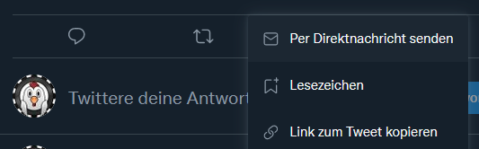
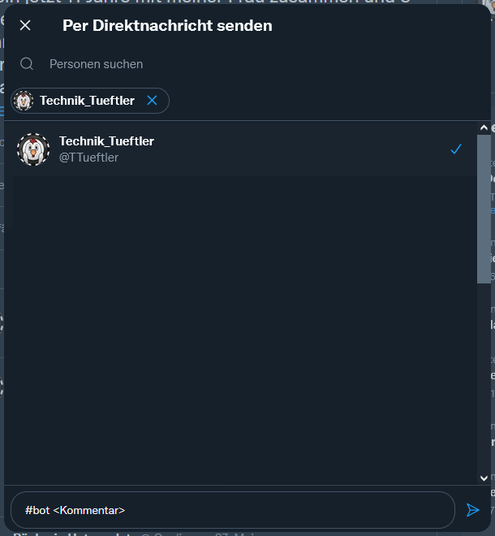

# TwitterBot
Das Ziel des TwitterBots ist es, später auf Falschinformation, Diskriminierung und Rassismus
automatisch zu reagieren und eine eingelernte Antwort zu schreiben. Eine weitere Funktion soll das
Einteilen in politische Richtungen für Benutzer sein. Damit soll versucht werden Sarkasmus zu 
identifizieren, um Fehlantworten zu vermeiden. Der aktuelle Stand enthält 
eine App `message_handler`, welche in einem vorher festgelegten Zeitraum
die Twitter Nachrichten des Accounts `@TTeuftler` abruft. Die abgerufenen Nachrichten werden auf den
Hashtag `#bot` geprüft und sollen dafür genutzt werden, einzelne Tweets und Twitter Benutzer für
eine spätere Analyse zu speichern.

[english readme](https://github.com/Technik-Tueftler/TwitterBot/blob/main/README.md)
 • [deutsche readme](https://github.com/Technik-Tueftler/TwitterBot/blob/main/README.de.md)

# Registrieren von problematischen Tweets
Wenn ihr einen Tweet entdeckt, welcher relevant sein könnte für eine spätere Analyse, reicht es
diese einfach zu teilen und als Direktnachricht an @TTueftler zu schicken.  

## Aufbau der Nachricht

## Kommentare
Die Kommentare sollten immer ähnlich aufgebaut werden und möglichst kurz sein. 
Dürfen aber natürlich auch immer individuell ausfallen. Zu beachten ist aber, dass nicht mehr als
500 Zeichen gespeichert werden.

### Vorschläge für Kommentare
| Kommentar    | Erklärung                                                                                  |
|--------------|--------------------------------------------------------------------------------------------|
| liberalismus | Grundposition einer politischen Orientierung                                               |
| account      | User schreibt generell Antworten oder Tweets die interessant für eine Analyse sein könnten |
| hetze        | Feindselige Stimmung gegen eine Person oder Organisation                                   |
| bodyshaming  | abwertende Äußerungen über das Aussehen Anderer                                            |

### Zusätzliche Markierungen von Wörtern
| Zeichen | Erklärung                                                                                       |
|---------|-------------------------------------------------------------------------------------------------|
| ?WORT?  | Findest du eine einzelnes Wort das Problem am Text, packe es eingepackt in `?` in das Kommentar |

